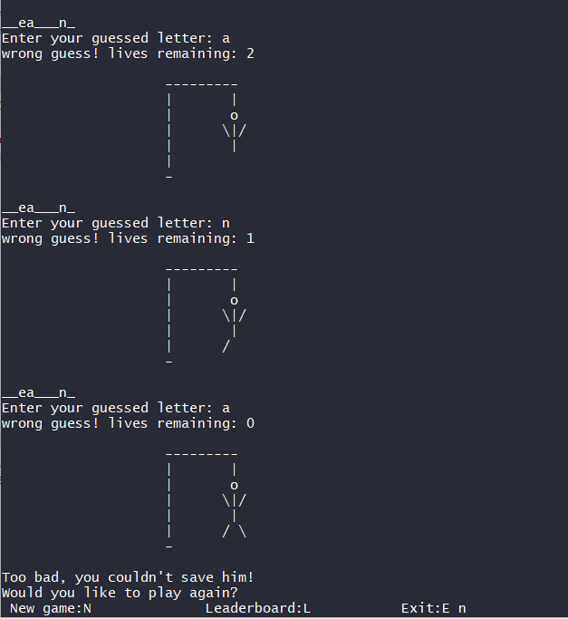

# HangmanGame
Hangman: A classic console game developed with python3 where a player guesses the correct word to survive.

## Game description
To play the game, you start by guessing the next letter of the word in question with the goal of saving the guy, with 6 possible tries.
At each step of the game, the state of the man in trial is printed.

While the game is conceptually simple, it demonstrates usage of several tools/frameworks including:
- sqlite as an embedded in-memory/local database to store the questions and answers.
- mysql as another source of database to store a harder set of questions and their answers.
- filesystem as a default source if the previous two modules were not installed on the system.

The game consists of 3 modules.
- Printer of the man under trial
- Data source of questions/answers(sqlite,mysql,remote,local)
- Score Leaderboard

## Screenshots

## Future work
- A GUI version of the game using libraries such as PyQt5, Tkinter or WxPython.
- An online source of questions/answer using an API, or scraping data and decoding them with BeautifulSoup given a URL.
